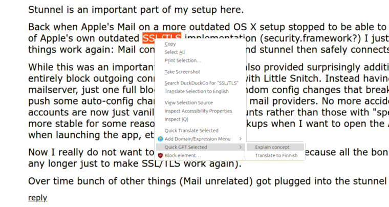
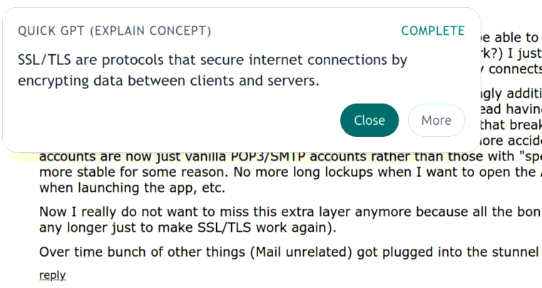
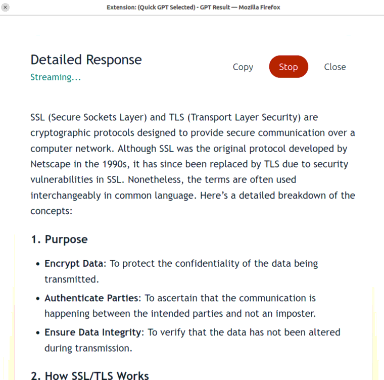
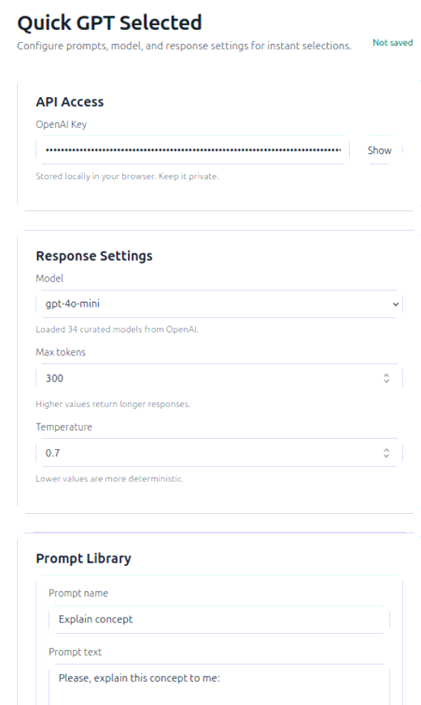

# Quick GPT Selected (Text)

Simple Firefox plugin that does Quick GPT query of selected text in the browser with options to configure custom prompts.

## Usage

Select text in a page, right-click, and choose a prompt from the Quick GPT Selected menu.  The response streams inline near your selection. Click "More" in the inline card to open a popup with a detailed response.

## Screenshots

<table width="100%">
  <tr>
    <td width="33%">
      <strong>Context menu</strong> 
      
    </td>
    <td width="33%">
      <strong>Short answer (inline)</strong> 
      
    </td>
    <td width="33%">
      <strong>Long answer (popup)</strong> 
      
    </td>
  </tr>
</table>

## Installation

### Firefox Add-ons (recommended)

Install the official add-on from Mozilla:
https://addons.mozilla.org/addon/quick-gpt-selected/

### Manual install (legacy / testing)

Download the latest XPI from GitHub Releases:
- [quick_gqt_selected.xpi](https://github.com/ikanher/quick-gpt-selected/releases/latest/download/quick_gqt_selected.xpi)

Go to 'about:addons' in Firefox. Click the settings wheel. Choose 'Install Add-on From File'. Navigate to the XPI and click 'Open'.

Legacy build:
- The legacy XPI is for older Firefox versions that do not support the latest manifest fields.
- If you need Firefox 134 or earlier, download:
  - [quick_gqt_selected-legacy.xpi](https://github.com/ikanher/quick-gpt-selected/releases/latest/download/quick_gqt_selected-legacy.xpi)

### Release checklist

1. Build the AMO (modern) package:
   - `make xpi`
2. Build the legacy package:
   - `make legacy-xpi`
3. Upload:
   - AMO: upload `dist/quick_gqt_selected.xpi`
   - GitHub Releases: attach both `dist/quick_gqt_selected.xpi` and `dist/quick_gqt_selected-legacy.xpi`

## Configuration

**OpenAI (ChatGPT) API key needed**: Open the add-on settings and add your OpenAI key.

You can also configure your own prompts, as seen below.

  

## License

MIT
